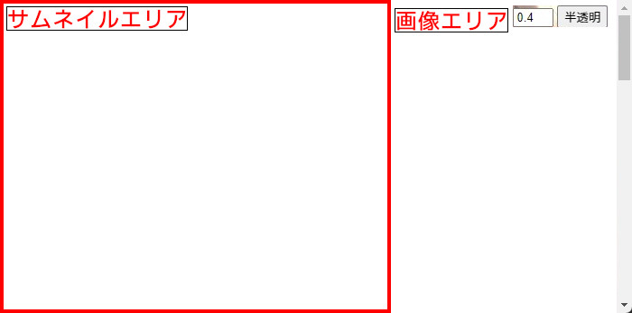

# 何？

  
フォルダ内の画像(jpg|jpeg|png|gif)を差分でまとめて表示する。  
(作者名)-(作品ID)-(作品名)-(差分index).jpg  
のフォーマットを想定して作成している。  
取得範囲の拡張子やソートのフォーマットを変更したい場合、js/all-create.jsとjs/img_src.jsを参照  

# 使い方
1. nodejsをインストールする  
2. まとめたい画像のあるフォルダに以下のファイルとフォルダを入れる
   - js/*  
   - 0.html  
   - 0-all-create.bat
   - 画像ファイル(*.jpg等)
3. 0-all-create.batを起動する  
4. 0.htmlでブラウザ立ち上げ
   
# ブラウザ操作

|キー|動作|
|-|-|
|→, d|次の画像|
|←, a|前の画像|
|w,s|次,前のサムネイル|
|r|ランダムなサムネイル|
|q,e|拡大,縮小|
|f|UI非表示|